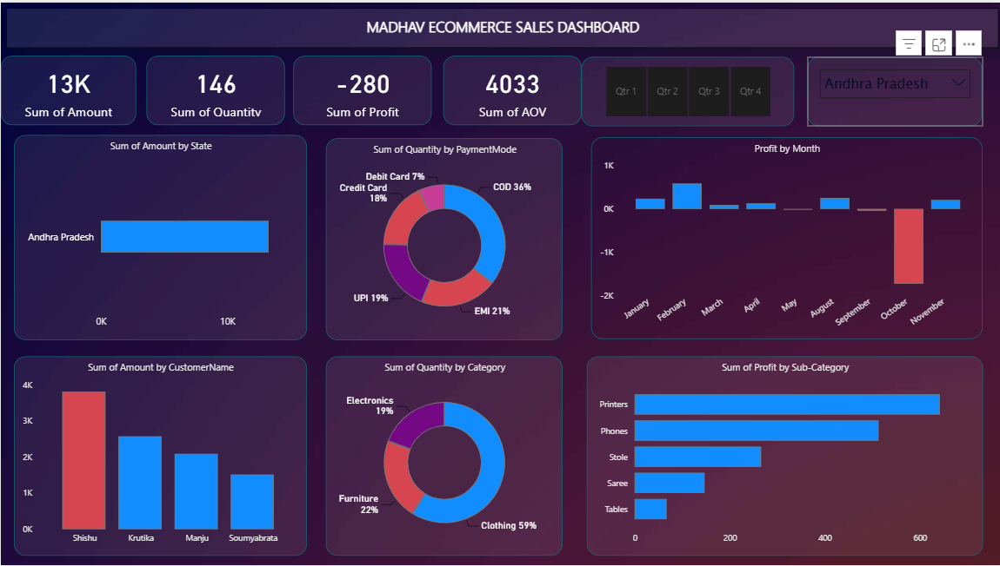

# 📊 Madhav Ecommerce Sales Dashboard | Power BI

An interactive Power BI dashboard built to track and analyze online ecommerce sales data across states, categories, payment modes, and customers — enabling data-driven business decisions through dynamic filtering and drill-down analysis.

---

## 🖼️ Dashboard Preview

---

## 🎯 Project Objective

To design a single-page, executive-style Power BI dashboard that gives stakeholders an at-a-glance view of ecommerce performance — sales volume, profitability, customer behavior, and payment trends — with the flexibility to slice data by quarter and state.

---

## 🔑 Key Features

- **Interactive KPI Cards** — Sum of Amount, Sum of Quantity, Sum of Profit, and Sum of AOV (Average Order Value), updating live with filter selections
- **Quarter Slicer (Qtr 1–4)** and **State Dropdown Filter** for dynamic, user-driven analysis
- **Multiple Visualization Types**: Bar charts, donut charts, clustered bar charts, line/area charts, and map visuals
- **Drill-Down Capability** using complex parameters to explore data at granular levels
- **Data Modeling**: Created table relationships, joined multiple data sources, and built calculated columns/measures using DAX

---

## 📈 Dashboard Breakdown

| Visual | Insight |
|---|---|
| Sum of Amount by State | Regional sales distribution (filterable by state) |
| Sum of Quantity by Payment Mode | COD leads at 36%, followed by EMI (21%) and UPI (19%) |
| Profit by Month | Monthly profit trend — highlights a sharp dip in October |
| Sum of Amount by Customer Name | Top customers by purchase value |
| Sum of Quantity by Category | Clothing dominates at 59% of total quantity sold |
| Sum of Profit by Sub-Category | Printers and Phones are the highest profit-generating sub-categories |

---

## 💡 Key Business Insights

- **Payment behavior**: Cash on Delivery (COD) remains the most preferred payment mode at 36%, suggesting continued trust barriers toward digital payments in this customer segment.
- **Profit volatility**: A significant profit drop in October indicates a potential seasonal issue, discounting strategy, or return/refund spike worth investigating further.
- **Category performance**: While Clothing drives the highest sales quantity, Printers and Phones (Electronics) generate the most profit — highlighting a quantity vs. profitability mismatch worth exploring for pricing strategy.
- **Customer concentration**: Sales are concentrated among a small set of top customers, indicating an opportunity for customer diversification strategies.

---

## 🛠️ Tools & Techniques Used

- **Power BI Desktop** — Report building & visualization
- **Power Query** — Data cleaning, table joins, and transformations
- **DAX** — Calculated columns and measures (Profit, AOV, etc.)
- **Data Modeling** — Relationships between multiple tables
- **Slicers & Filters** — Quarter and State-based interactivity

---

## 📚 Project Learnings

- Created an interactive dashboard to track and analyze online sales data
- Used complex parameters to enable drill-down functionality and worksheet customization via filters and slicers
- Built connections and joined multiple tables, applying calculations to manipulate data and enable user-driven visualization parameters
- Applied a variety of customized visualizations — bar chart, pie chart, donut chart, clustered bar chart, scatter chart, line chart, area chart, map, and slicers

---

## 📂 Files in this Repository

- `dashboard.pbix` — Power BI project file (open in Power BI Desktop to interact)
- `screenshots/` — Dashboard preview images
- `README.md` — Project documentation

---

## 🔗 Connect

Feel free to explore the `.pbix` file for the complete data model, DAX measures, and report design.

**Author:** Amrit Mishra
